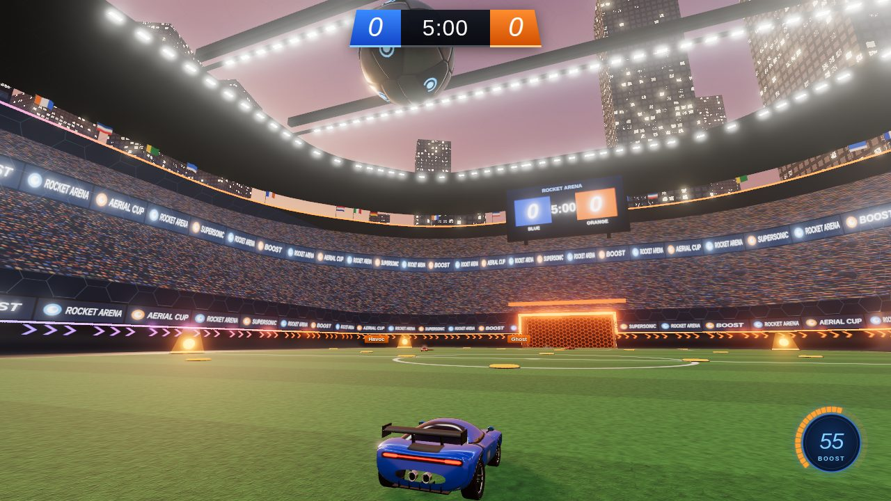
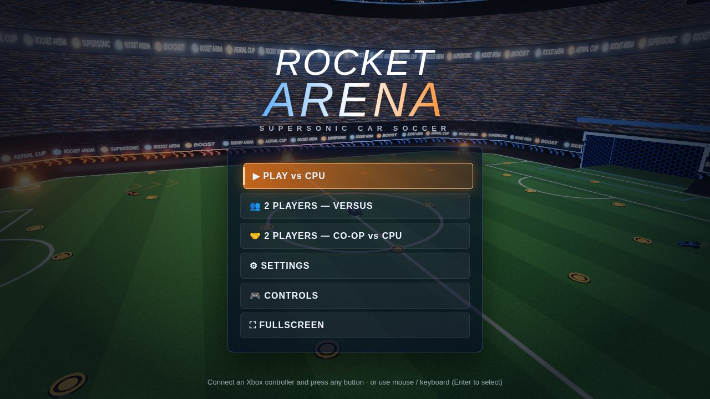
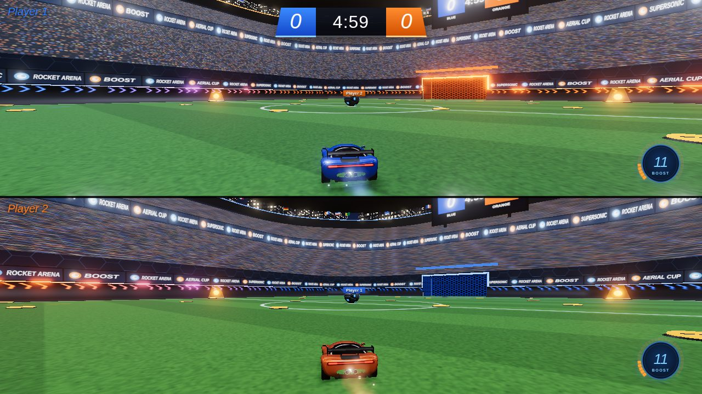
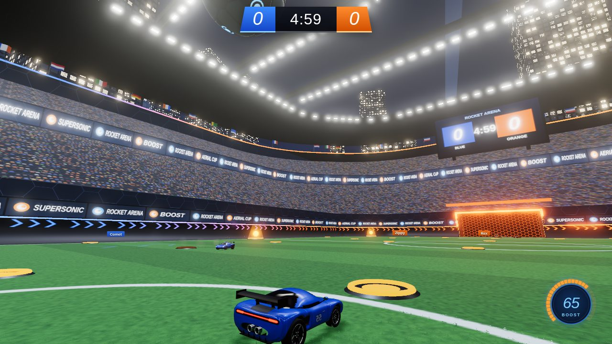
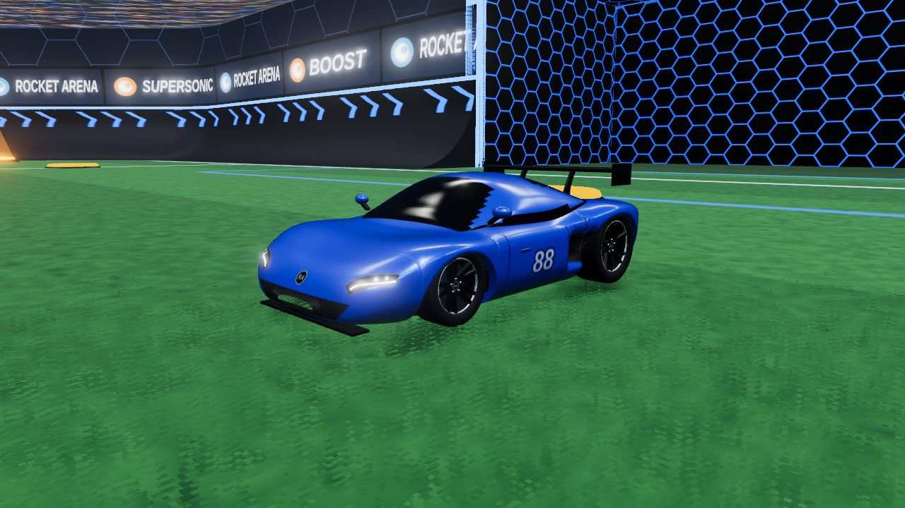
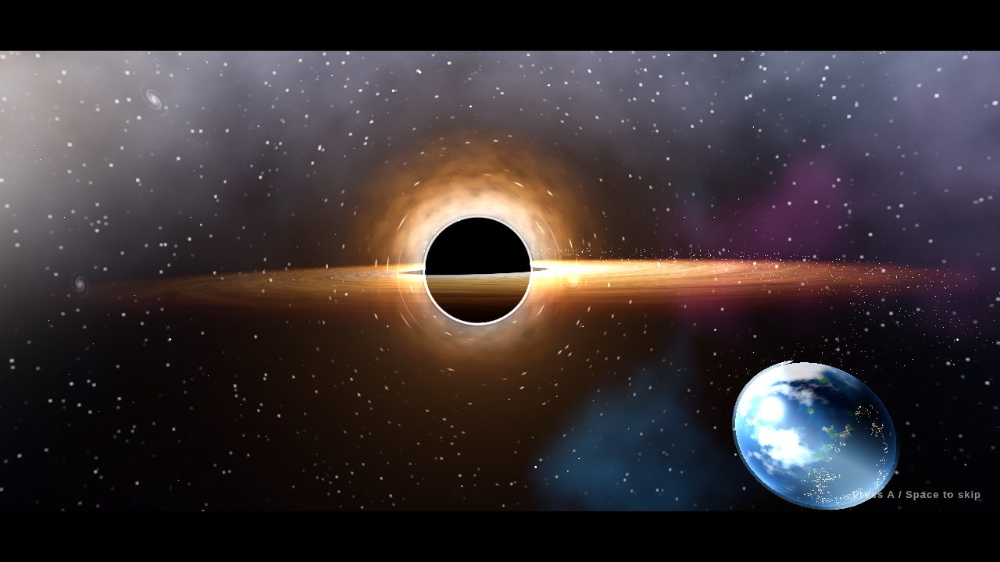

# Rocket Arena

A Rocket League–style car soccer game that runs in the browser. It has 3D graphics, physics modelled on the real game, CPU opponents, **local 2-player split screen**, and full **Xbox controller** support.



| Main menu | 2-player split screen |
| --- | --- |
|  |  |



| The cars | Victory cinematic |
| --- | --- |
|  |  |

## Features

- **Physics close to the real game.** It uses Rocket League's units and numbers: 2300 uu/s top speed, boost, supersonic, jump and double jump, flips and dodges, air roll, powerslide, and Psyonix-style ball hits. Cars can drive up the curved walls. The ball bounces and spins realistically.
- **Full soccar arena.** Standard field size with the corner walls and goals. All 34 boost pads are in their real positions: 6 big pads give 100 boost and 28 small pads give 12.
- **Game modes**: Soccar (standard), **Heatseeker** (after every touch the ball homes in on a goal and curves in on its own) and **Rumble** (power-ups such as grappling hooks and tornadoes). Details are below.
- **Ways to play**
  - *Play vs CPU*: 1v1, 2v2 or 3v3 against bots with three skill levels (Rookie, Pro, All-Star).
  - *2 Players — Versus*: split screen, Player 1 (blue) vs Player 2 (orange). You can fill the teams with bots for 2v2 or 3v3.
  - *2 Players — Co-op*: split screen, both players on blue against CPU opponents.
- **Match rules.** Kickoff countdown, 3/5/7-minute or unlimited matches, and a golden-goal overtime. Time runs out only once the ball touches the ground. Goal explosions are followed by an instant replay. Supersonic hits demolish cars. The post-game screen shows stats (score, goals, assists, saves, shots, demos) and an MVP.
- **Realistic sports cars.** Each car is a smooth GT coupé with real wheel arches, a tinted glass cabin, LED headlights and a full-width tail-light bar, door mirrors, side air intakes, a front splitter, a rear diffuser, twin exhausts and a swan-neck rear wing. The wheels have rounded tyres, spoked rims, brake discs and calipers. The paint is metallic with a clear coat, and the cars stay the same size as the Octane hitbox, so the handling is unchanged.
- **Stadium details from the reference photos.** Tyre marks are torn into the grass and dirt flies off the wheels. Cars have racing numbers on the doors. Big score screens show "GOAL!!" and fire jets go off when someone scores. Flags wave over the stands, chevrons glow on the walls, and searchlights sweep the sky at night.
- **Realistic visuals.** Night or sunset stadium with a city skyline, a crowd and floodlights. The grass is mowed in stripes. Goals glow and the walls are hex-glass. Lighting is physically based, with shadows and bloom. The ball has glowing panels, and boost flames and smoke trails come in team colours.
- **HUD in Rocket League style.** Score and clock bar, circular boost meter, name plates, ball cam / car cam.
- **Sound effects** for the engine, boost, hits, goals and the crowd. All of them are generated in code, so no audio files are needed.
- **Controller rumble** on hits, bumps, demolitions and goals.
- **Victory cinematic.** When your team wins, the back of the other team's goal flaps down and a glowing road builds itself up into the sky. Your car drives up it and falls off the end into a black hole, where it explodes. The black hole swells and sucks in the stadium and the whole city. The camera pulls out into space to show a black hole far bigger than the Earth swallowing the planet, and then the whole universe explodes. Press **A**, **Space** or **Start** to skip it, or turn it off in **Settings**.

## Playing

### Quick start

Open `index.html` in Chrome, Edge or Firefox. No install or build is needed because the compiled game (`dist/game.js`) is already in the repo.

You can also serve the folder:

```bash
npm start          # serves the folder on http://localhost:8080
```

### On an Xbox

1. Host the game online. The easiest way is **GitHub Pages**: on GitHub open *Settings → Pages*, then choose *Deploy from a branch* with the `main` branch and the `/ (root)` folder.
2. On the Xbox, open **Microsoft Edge** and go to your Pages URL (`https://<user>.github.io/<repo>/`).
3. Pick **⛶ Fullscreen** in the main menu, or use Edge's full-screen option. Then play with your controllers.

The game uses the browser's Gamepad API, which works with Xbox One and Xbox Series controllers in Edge, Chrome and Firefox. On a PC, connect the controllers over USB or Bluetooth and press any button so the browser detects them.

### Two players

1. Choose **2 PLAYERS — VERSUS** (or **CO-OP vs CPU**) and set the match options.
2. On the join screen, controller players press **A**. A keyboard & mouse player clicks an empty slot or presses **Space** (WASD + mouse). A second keyboard player can press **Enter** for the arrow keys. Press **B** (controller) or **Backspace** (keyboard) to leave.
   Mixing devices works: for example one player on an Xbox controller and the other on keyboard & mouse.
3. Once both players have joined, press **A** or **Start** to kick off. The screen splits top/bottom; you can switch to side-by-side in the setup screen.

## Game modes

Pick one on the match setup screen.

- **Soccar**: standard car soccer.
- **Heatseeker**: after every touch the ball flies at the other team's goal and curves in on its own. It speeds up a little with each touch. If it hits the wall above or beside the goal, it heads back the other way. Defend by getting a touch on it.
- **Rumble**: every few seconds each player gets a random power-up, shown above the boost meter. Use it with **RB** on a controller, **F** on keyboard & mouse, or **H** for the arrow-keys player. You can also pick a single power-up type (for example "Grappling Hook only") under **Power-ups**.

| Power-up | What it does |
| --- | --- |
| 🪝 Grappling Hook | Fires a hook at the ball and reels your car in to it |
| 🪠 Plunger | Hooks the ball and pulls it to you |
| 🌪️ Tornado | Spins a tornado around your car for 5 seconds that lifts and throws the ball and nearby cars |
| 🌀 Curveball | Bends the ball's path so it curves into the other team's goal |
| 📌 Spikes | The ball sticks to your car; flip to shoot it off |
| 👢 Boot | Kicks the nearest opponent into the air |
| 💥 Power Hitter | Huge hits, and you demolish anyone you touch, for 8 seconds |
| ❄️ Freezer | Freezes the ball in place until someone touches it |

## Controls

| Action | Xbox controller | Keyboard & mouse (P1) | Keyboard (P2) |
| --- | --- | --- | --- |
| Accelerate | **RT** | W | ↑ |
| Brake / reverse | **LT** | S | ↓ |
| Steer, and pitch/yaw in the air | **Left stick** | A / D (W / S pitch) | ← / → |
| Jump; press again to double jump, or flip with a stick direction | **A** | Space or Right mouse | K |
| Boost | **B** | Left Shift or Left mouse | L |
| Powerslide; hold for air roll | **X** | C / Left Ctrl | J |
| Air roll left / right | **LB / RB** | Q / E | U / O |
| Ball cam on/off | **Y** | R or Middle mouse | I |
| Look around | **Right stick** | – | – |
| Use power-up (Rumble) | **RB** | F | H |
| Pause | **☰ Menu** | Esc | P |

In single player, both keyboard layouts and any connected controller work together.

Moves to try:
- **Flip:** jump, then press jump again while pushing the stick. Front flips add a big burst of speed.
- **Wall driving:** drive into a wall at speed and the car rides up the curve.
- **Demolition:** ram an opponent with the front of your car while boosting (above about half speed) or while supersonic, and they explode. They respawn by their goal 3 seconds later. Two boosting cars meeting head-on both explode. Teammates are safe.
- **Getting unstuck:** if you land on your roof, press jump to flip back onto your wheels.

## Settings

**Handling** (Easy or Realistic), graphics quality, default camera, field of view, goal replays, the victory cinematic, rumble, volume and an FPS counter can be changed in **Settings**. *Easy* handling, the default, grips harder, turns tighter at speed, and eases keyboard steering in smoothly. *Realistic* uses Rocket League's exact turning and grip. The defaults are **High** on desktop and **Medium** on Xbox. Choose **Low** on slower machines. You can also force a quality level with the URL, e.g. `index.html?quality=low`.

## Development

```bash
npm install        # three.js + esbuild
npm run build      # bundles src/ into dist/game.js (commit this file so the game runs without a build)
npm run dev        # live dev server on http://localhost:8080 that rebuilds on save
npm test           # physics + game-mode unit tests and a headless bot-vs-bot simulation
npm run test:browser   # Playwright tests: 2P with simulated Xbox pads, controller + keyboard & mouse, full match flow
```

### Project layout

```
index.html, style.css      page, HUD and menu styles
dist/game.js               built game (generated by `npm run build`)
src/
  main.js                  app bootstrap, main loop, settings
  config.js                arena size, physics constants, boost pad layout
  arena.js                 arena collision (signed distance field) + outline for meshes
  physics/                 car, ball and world simulation (fixed 120 Hz step)
  ai.js                    CPU players
  game.js                  match flow: kickoff, goals, overtime, replays, stats
  input.js                 keyboard + Gamepad API (Xbox mapping, rumble)
  hud.js, menu.js          scoreboard/boost meter and controller-friendly menus
  audio.js                 WebAudio sound effects
  render/                  three.js stadium, car model, effects, camera, renderer,
                           victory cinematic (victory.js, blackHole.js, space.js)
tests/                     node + Playwright tests
```

---

Rocket Arena is a fan-made, non-commercial tribute. It is not affiliated with or endorsed by Psyonix or Epic Games. "Rocket League" is a trademark of Psyonix LLC.
